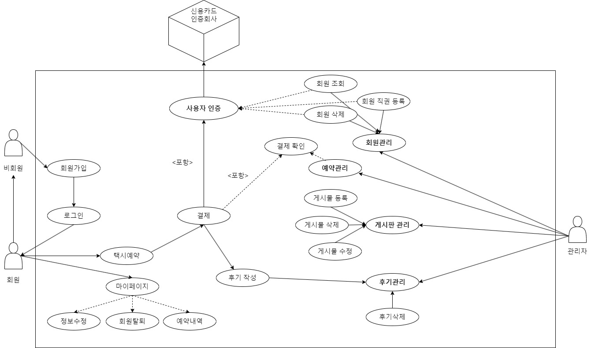
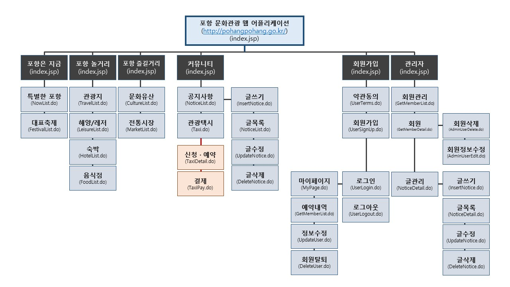
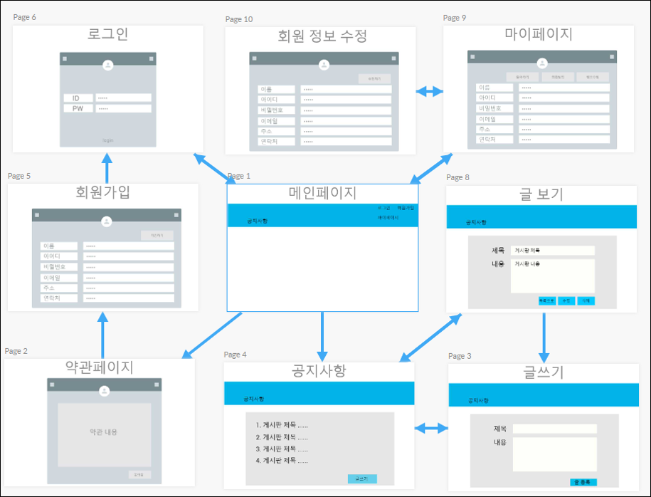
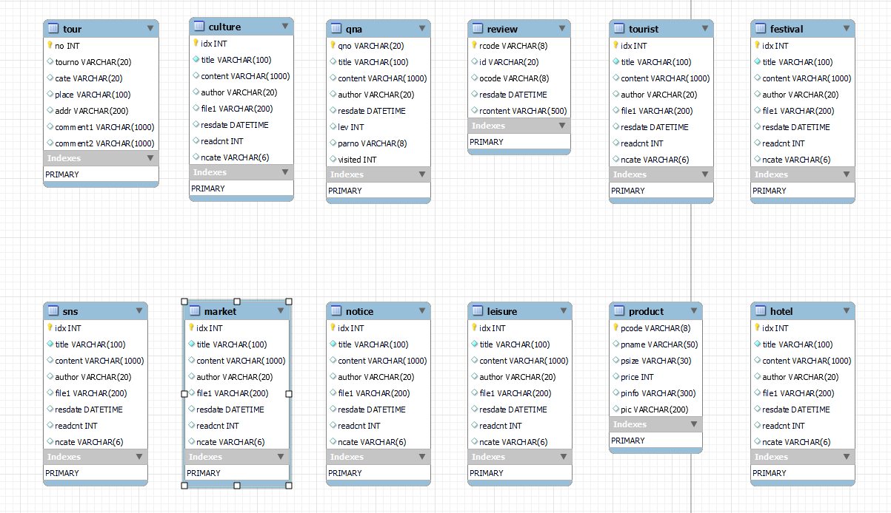
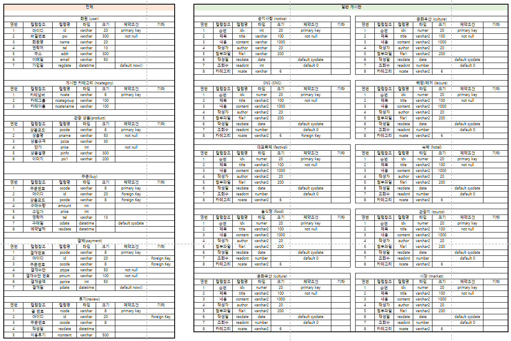
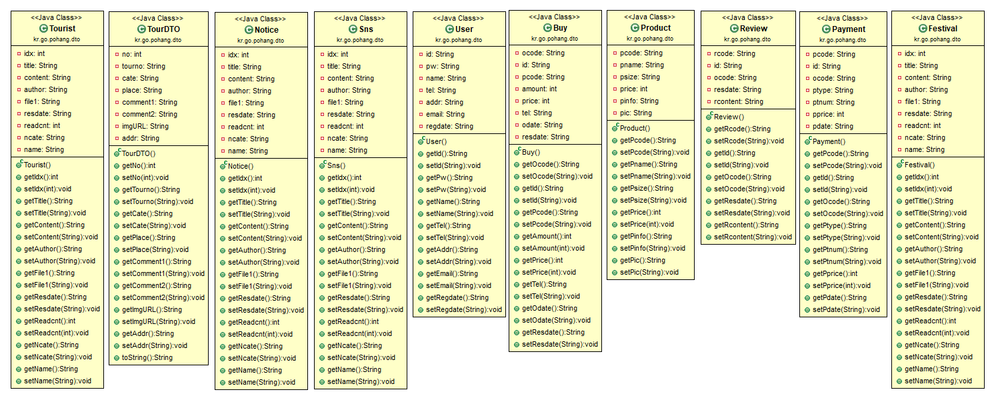
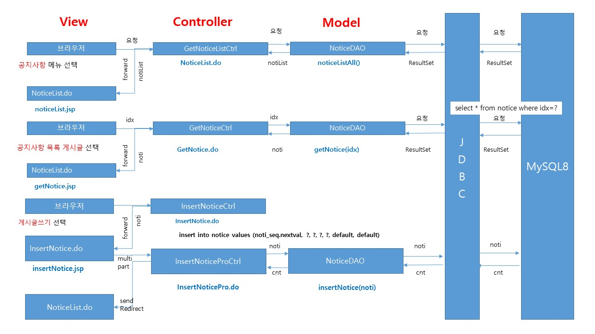
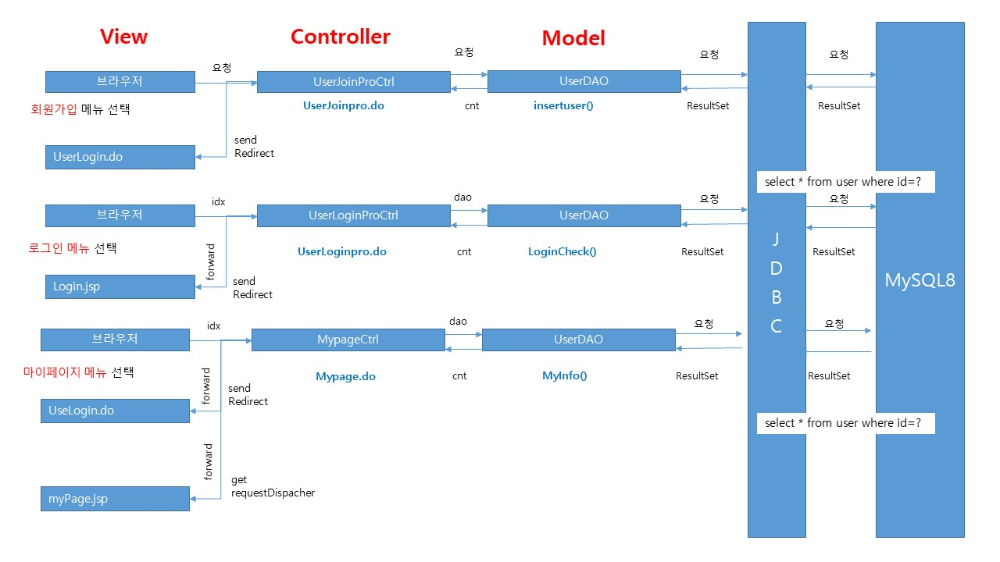
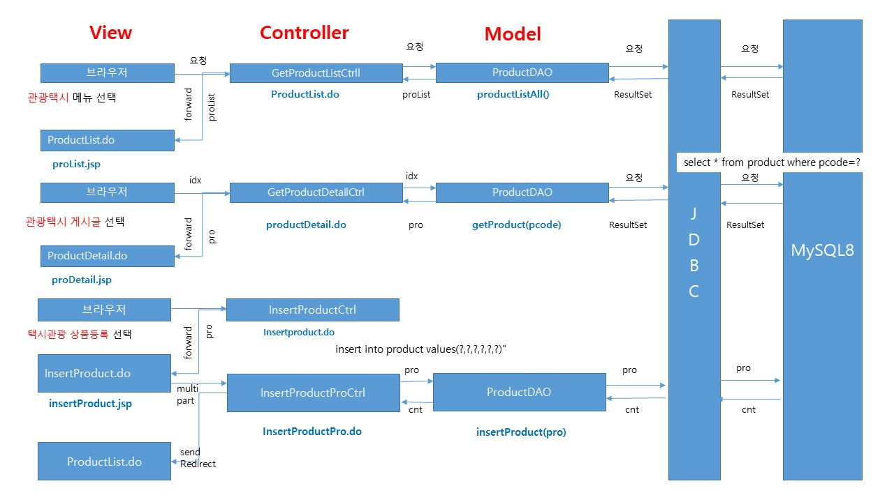
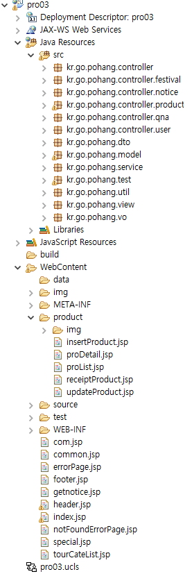

# 프로젝트 개요

## 프로젝트 명: OHMYZIP(오마이집)

## 프로젝트 기간: 2023. 05 .03 ~ 05.16

## 프로젝트 참여: 이다영

## 자바 버전: jdk 1.8

## 자바 스크립트 버전: 1.0

## 다이나믹 맵 모듈: 3.1

## 사용 DBMS: Mysql

## 자바 사용 라이브러리: crypto, json, cos, commons, mail

## CSS 프레임워크: 부트스트랩 3.3.2

## 자바스크립트 플러그인: JQuery

## 자바스크립트 api: daum 주소 api, json 데이터 처리, iamport 결제 api

## 프로젝트 데이터 처리 패턴: MVC2(View -> Controller -> Model -> Controller -> View)

## 프로젝트 주요 기능: 회원, 공지사항, 이용후기, 장바구니, 판매(예약), 결제, 글(글쓰기/글관리/글목록), 상세페이지 기능 등
 
------------------------------------------------------------------------------------------------------------------------------------------------------------- 
## 프로젝트 특이 사항
- 회원 가입시 중복체크는 json을 활용하여 별도의 팝업 창이 없이 현재 창에서 구현
- 회원 가입시 주소의 입력은 daum 주소 api를 활용하여 주소를 전달
- 회원의 비밀번호는 md5, sha256, aes256 등으로 암호화하여 처리
- 회원 가입 후에는 네이버 메일 서버 또는 Gmail 서버로 가입 축하 이메일 발송
- 공지사항은 파일 첨부(업로드) 기능을 함께 구현
- 공지사항 전체 목록의 페이징 처리와 검색 기능 구현
- 공지사항 글의 상세보기 화면에서 해당 게시된 공지 중에서 파일 다운로드 기능 추가
- 결제 기능을 결제 api 기능을 활용하여 다양한 방법으로 결제 테스트가 가능
- 해당 상품 예약의 경우 메인/서브 페이지 모두에서 링크로 연결
- 이용후기는 해당 상품을 예약하는 페이지 하단에 배치 및 구성하여 게시할 수 있도록 처리

 
------------------------------------------------------------------------------------------------------------------------------------------------------------- 

# 프로젝트 설계
## 개념적 설계
- 유스케이스

## 논리적 설계
- UI 요구사항 및 프로세스

## 물리적 설계
- 데이터 베이스 ERD

## 클래스 설계
- 클래스 다이어그램

## 시퀀스 설계
- 시퀀스 설명

# 프로젝트 구성
